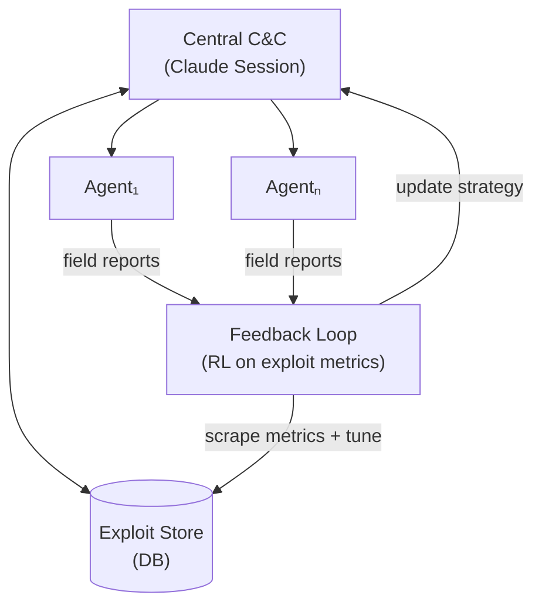

Anthropic announced [Project Glasswing](https://www.anthropic.com/glasswing) this week, the tl;dr is that they believe that they have developed a vulnerability detector and exploiter so powerful that the biggest players in tech need a headstart to patch before the inevitable doom that is the AI-pocolypse when exploitation on steroids is in the hands of any [script kiddie](https://en.wikipedia.org/wiki/Script_kiddie) in their basement.

I think something like this has been brewing for a while. Once Anthropic had published that their services were being used as [command and control](https://en.wikipedia.org/wiki/Botnet#Command_and_control) and actual worker process for those types of processes from adversaries, my brain went wild with what that meant for cyberwarfare, and how can you react and play defense against such a powerful automation platform.

I have found [Stuxnet](https://en.wikipedia.org/wiki/Stuxnet) to be one of the most amazing feats of technology in being able to traverse an [air-gapped network](https://en.wikipedia.org/wiki/Air_gap_(networking)) after infiltration to infect a very specific set of hardware. There's two things that I think have to happen there, is knowing what points are available to you to bounce to until you hit your target, and covering your tracks/avoiding detection. Being able to explore a network and then make your way to specific boxes all offline is CRAZY to me, and that was 10 years ago. It would be foolish to think that level of out of the box thinking and development prowess wouldn't continue to exploit what it can with one of the most powerful automation tools of our time.

I imagine there are systems out there at the moment only researching [exploits](https://en.wikipedia.org/wiki/Exploit_(computer_security)) fulltime for multiple nation states. Opus 4.6 I think wielded by the right set of people have and would find exploits that are deeper than what Opus does with an amateur. Given that then, the actual seek and destroy, or in this case, seek and settle strategy comes into play. You're now in an even faster arms race with others also running these analysis on the [red team](https://en.wikipedia.org/wiki/Red_team) side, they will find the easy ones too, but then yadda yadda it's a never ending cat and mouse game again. Which is kind of where we are already.

### A tangent
This is one of the things that is getting to me about the rapid advancements we are seeing in AI. I have increased my velocity significantly in my hobby programming and my work programming by having Claude Code become an extension of my computer brain. I am very good at linux-y and sysadmin-y activities as well as quickly writing code by hand, but the tool has made me super human, it's been a wonderful feeling to feel like work has become easy for me. But then I need to remember that it took me 15 years of development/.tech experience to get the place that I am so that I can use these new super powers. It's been good to reminisce and think about where I learned certain skills I've been leaning on lately to work with the AI. Some of them include:

Helpdesk experience
Negotiating with a Toddler
Guess and checking as a learning method
Web Adminstration
All my sysadmin knowledge across soooo many years

I smiled when I heard someone describe interacting with an LLM as just being pipes of text into pipes of text, and immediately realized thats why I like the AIs and why I like linux, it's just fun to work with text streams to get what you want. To me it feels like a stream of thought and data that i can manipulate quickly with my thoughts now.

But here's the rub, I still get stuck on similar types of problems that I was running into in the past. Integrations between disparate components is still hard, and unless you know your domain, and your tech lingo you still get subpar results. There's no compression algorithm for experience, and I'm stuck on that, but [reinforcement learning](https://en.wikipedia.org/wiki/Reinforcement_learning) feels like that for LLMs lately, so these LLMs are definitely powering up.

### Stay on Target

Ok, well I imagine the following system:

This is the basic agent loop, but I can start imagining scenarios where agents sit with knowledge of whats exploited and when an operation starts, the agents ramp the hell up.

From there the agents can retrieve an exploit to try it out and mark it as working, use that as [RAG](https://en.wikipedia.org/wiki/Retrieval-augmented_generation) for quickly finding if certain strategies are working than others. Let them learn from themselves as they crawl and exploit the internet.

From the defense side of things I think a lot of it remains the same, but rapid detection will need to close the gap between detection and quarantine and shutting down an attack. It must be very fast but has to be safe. I don't know enough about the current state of how [endpoint protection](https://en.wikipedia.org/wiki/Endpoint_security) clients work nowadays, but I imagine if they are using some sort of model themselves that is profiling all system activity. Overtime you collect enough normal system activity to know what inputs are normal across a lot of different types of computers out there. Then when a system starts to even step a little out of line, it trips the model into alerting. That seems like a good way of doing it to me, I'm sure it's a lot harder said than done, but if you're at a level low enough watching for out of the ordinary CPU behavior, you got yourself a winner given a good enough model. Not talking LLMs here to be clear, just the old ML version of model.

Speed to finding some of the bugs will mean they are patched quicker. They will start with the most installed software for mitigation, but then that opens up all the single off devices that are setup around the world with less popular software. So many are built on these opensource libraries from long ago that will easily be exploitable soon... allegedly.

I fully believe the blackhats have developed these by now, if I had time my version of this would be proactive system administration of a unknown network. Something like that is going to have to be crawling the internet as a defense eventually. Who will foot the bill for such a technology?
